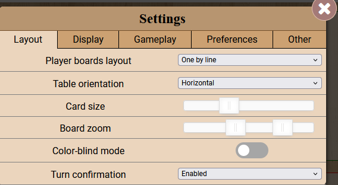
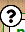

core module
===========

The core module is the ``game.js`` file in the ``modules/js/Core`` directory. It is the main file that extends the "base" game class.

As for any other additional component, you must declare it at the top of your Javascript file in the list of modules used. 

Extract of the ``foogame.js`` file:

.. code-block:: js

    define([
        'dojo',
        'dojo/_base/declare',
        g_gamethemeurl + 'modules/js/vendor/nouislider.min.js',
        'ebg/core/gamegui',
        'ebg/counter',
        g_gamethemeurl + 'modules/js/Core/game.js', // <= this is the current module
        g_gamethemeurl + 'modules/js/Core/modal.js',
        g_gamethemeurl + 'modules/js/Players.js',
    ], function (dojo, declare, noUiSlider) {

This page will explain the main features and additions to the framework.

Settings
--------

The boilerplate includes a default settings window (cog icon on top of player panels) which opens a modal with settings.

This modal can be customized according to you needs.

    
    A Modal Settings with the various options types.

Setting sections
~~~~~~~~~~~~~~~~

You can define you setting sections (tabs in the modal) by adding entries ``getSettingsSections()`` of your ``foogame.js`` file.

For example, the default sections are :

.. code-block:: js

    getSettingsSections() {
      return {
        layout: _('Layout'),
        other: _('Other'),
      };
    },

The keys of the object are the section references and the values are the (translatable) section names.

Settings config
~~~~~~~~~~~~~~~~

You can easily add settings to the sections by adding entries in the ``getSettingsConfig()`` method of your ``foogame.js`` file.

This method retuns an object where each entry has specific fields:

    - ``default``: the default value of the setting
    - ``name``: the name of the setting. It must be translatable, so encapsulate it with ``_()``
    - ``attribute``: the attribute of the game object where the setting will be stored (stored in ``data-<attribute>``)
    - ``section``: the section reference where the setting will be displayed (the same as the section key in ``getSettingsSections()``)
    - ``type``: the type of the setting (choices are : ``select``, ``switch``, ``slider``, ``multislider`` or ``pref``) (see details below)
    - ``prefId``: When type = ``pref``: the preference id of the setting 
    - ``sliderConfig``: When type = ``slider``: the configuration of the slider

Settings types
~~~~~~~~~~~~~~

The following types are available:

    - ``select``: a dropdown list where an option can be selected.
    - ``switch``: an on/off switch.
    - ``slider``: a slider with a range of values.
    - ``multislider``: two sliders to define a range of values (max/min for example).
    - ``pref``: a dropdown list that uses the BGA preference system to store the value.

Type specific configuration
~~~~~~~~~~~~~~~~~~~~~~~~~~~~

- **Select type**

An object with key ``values`` needs to be defined where the key are the values of the options and the values are the translatable names of the options.

Example:

.. code-block:: js

    playerBoardsLayout: {
          default: 0,
          name: _('Player boards layout'),
          attribute: 'player-boards-layout',
          type: 'select',
          values: {
            0: _('One by line'),
            1: _('Two by line'),
            2: _('Grid layout'),
          },
          section: 'layout',
        },

- **Switch type**

No specific configuration needed.

Example:

.. code-block:: js

    colorBlindMode: {
          default: 0,
          name: _('Color-blind mode'),
          attribute: 'color-blind',
          type: 'switch',
          section: 'display',
        },

- **Slider and MultiSlider type**

An object with the key ``sliderConfig`` object needs to be defined with the following keys:

    - ``step``: the step of the slider
    - ``padding``: buffer zone at the start and end of the slider's range.
    - ``range``: the range of the slider, with the following keys:
        - ``min``: the minimum value of the slider
        - ``max``: the maximum value of the slider

.. note::

    When type is ``multislider``, the default value must be an array with the default of each sliders.

Example:

.. code-block:: js

    cardScale: {
          default: 100,
          name: _('Card size'),
          type: 'slider',
          sliderConfig: {
            step: 5,
            padding: 0,
            range: {
              min: [50],
              max: [150],
            },
          },
          section: 'display',
    },
    boardZoom: {
          default: [100, 150],
          name: _('Board zoom'),
          type: 'multislider',
          sliderConfig: {
            step: 5,
            padding: 0,
            range: {
              min: [0],
              max: [250],
            },
          },
          section: 'display',
    },

- **Pref type**

When the type is ``pref``, the ``prefId`` key must be defined with the preference id.
You can optionnaly set the ``local`` to ``true`` to store the value in the local storage only.

.. warning::

    The preference id must already be defined in BGA framework (using ``gamepreferences.json`` and reloading data in the control panel)

Example:

.. code-block:: js

    soundEnabled: {
          type: 'pref',
          prefId: 103,
          section: 'preferences',
        },

States
------

The ``onEnteringState`` method is called when the game enters a new state. The boilerplate includes some default behavior.

   1. Check if fast mode is enabled (replay mode), if so, skip the next steps.
   2. Customize page title: In the philosphy of keeping the front end dumb, it is possible to automatically update the page title according to some sitation for a single state by adding extra ``descriptionTurn`` in the state with some suffix. For example, if the state array includes a ``descriptionTurnpayAuthorityRL``, you can add in the args of the state a ``descSuffix`` that match the suffix (``payAuthorityRL`` in this case).
        
        Example:

            in ``states.inc.php``:	
                .. code-block:: php

                    # other states...
                    ST_PAY_AUTHORITY => [
                        'name' => 'payAuthority',
                        'type' => 'activeplayer',
                        'description' => clienttranslate('${actplayer} must select resources to pay for authority'),
                        'descriptionmyturn' => clienttranslate('${you} must select resources to pay for authority'),
                        'descriptionmyturnpayAuthorityRL' => clienttranslate('Pay ${res1} to reach level ${level}'),
                        'args' => 'argsPayAuthority',
                        'action' => 'stPayAuthority',
                        'possibleactions' => ['actPayAuthority', 'actCancelPayAuthority', 'actPassOptionalAction'],
                    ],
                    # ...

            in your ``argsPayAuthority()`` method:

                .. code-block:: php

                    #...
                    return ['descSuffix' => 'payAuthorityRL', 'res1' => $res1, 'level' => $level]; // don't forget to add the keys of string substitution you added in your custom description.

    3. Adding "Undo Last Step" and "Confirm" buttons : If the state args includes a ``previousSteps`` array, the game will automatically add a "Restart Turn" and "Undo last step" buttons to the game interface. The "Restart Turn" button is only added if there are more than one step to undo. A "Confirm" button is also added.
    4. **Call the appropriate** ``onEnteringState`` method if it exists. For example, if the state name is ``payAuthority``, the method ``onEnteringStatePayAuthority`` will be called if it exists.
            
The latter means that the expected code organization is to have a method ``onEnteringState<StateName>`` for the different states that needs it (with capitalized first letter).
Example : ``onEnteringStatePayAuthority`` for the state ``payAuthority``.

It simplifies the generic ``onEnteringState``code by splitting it to specific methods.

The ``onLeavingState`` method is called when leaving the state and focus on cleaning the interface:

    1. if the current mode is in "fastMode", next steps are skipped
    2. ``clearPossible()`` is called. See here.
    3. **Call the appropriate** ``onLeavingState`` method if it exists. For example, if the state name is ``payAuthority``, the method ``onLeavingStatePayAuthority`` will be called if it exists, as for `onEnteringState`.

onUpdateActionButtons
----------------------

.. warning::

    Despite the name of this framework method, this method is **NOT** designed to update the action buttons. It is more suited to identify a change in the current player status. For example, this method is called in multi-active states whenever a player is set inactive.

When this method is called, the ``_activeStatus`` bool is updated with the current player status.
as for the ``onEnteringState`` and ``onLeavingState`` methods, the ``onUpdateActionButtons`` method of the specific state is called if it exists.

Undo
----

Several method designed for the undo (if you use the :hoverxref:`Log<phpmodules/log:Log Module>` module).
However, only one needs to be updated with game-specific logic:

``refreshUI(datas)`` : Notifies the UI with the new game state. It typically takes the ``getAllDatas()`` results as parameter then filter out the actual data needed for the UI before sending it.

``refreshHand(player, hand)`` : Same as ``refreshUI(datas)`` but for private data. For example, if a player play a card face down, the information is still secret to other players but needs to be added back to the player hand.

Notifications
-------------

Notifications are managed in the boilerplate so that each of them works as Promises and do not interfere with each other. 

Setup
~~~~~

Each notification needs to be handled in their specific method with the format ``notif_<notificationName>``.
Additionally, a property ``_notifications`` need to be added in the constructor of your ``foogame.js`` to store the name of all notifications, their synchronous duration (if any) and potential predicate for ignoring the notification.
For example:

.. code-block:: js

    this._notifications = [
        ['refreshUI': 1000],
        ['refreshHand': 1000],
        ['revealActionCard', null],
        ['drawCards', null, (notif) => notif.args.player_id == this.player_id],
    ];

At the game setup, all notifications in the ``_notifications`` array are wrapped before being added to the ``dojo.subscribe()`` method.

The wrapping is doing the following:

    1. call a custom ``format_string_recursive`` to allow to more player coloration than player_name and player_name2
    2. update the page title with the notification message
    3. fetch the notification timing value if not defined in the ``_notifications`` array
    4. Override default timing by 1 in case of fast replay mode
    5. call ``setIgnoreNotificationCheck`` if a predicate is defined in the ``_notifications`` array

Usage
~~~~~

You can use the notifications in your game logic by calling the ``this.notif_<notificationName>`` method with the appropriate arguments.

Utils
~~~~~

``isFastMode()`` : Returns whether the game is in fast mode (meaning that animations are disabled for fast replay). see `this blog post <https://bga-devs.github.io/blog/posts/a-real-fast-replay-mode/>`_ for more information.

``getVisibleTitleContainer()`` : Returns the visible title container element.

``setupNotifications()`` : 

Taking actions
--------------

Taking action is wrapped to check if interface is locked before calling the ``bgaPerformAction`` method.
General practise is to use ``takeAction(action: string, data?: object, check: bool = true, checkLock:bool = true)``

By default, a custom div is used to add buttons to avoid being removed when ``onUpdateActionButtons`` is called. A wrapper is also implemented in that way and you can use ``addSecondaryActionButton`` and ``addDangerActionButton`` to add secondary (gray) and danger (red) buttons.

Additionally, you can also add a timer to (confirm) buttons using ``startActionTimer(buttonId, time, pref, autoclick = false)``. It is linked to user preference (no confirm button, with or without timer).
And you can stop the running timers with ``stopActionTimer()``

Help Mode and tooltips
----------------------

A "Help Mode" is implemented in the boilerplate to help mobile users to easily get tooltips on elements without risking to trigger actions.
A switch button is added by default on top of players panel to enable/disable the help mode.

    
    Help mode switch button.

When enabled, all elements with a tooltip will have a "help" icon added to the right of the element. Clicking on the icon will display the tooltip.

    
    Help Mode enabled with the help icon displayed on the right of the element.

To add a tooltip that is supported by the help mode, you can use the ``addCustomTooltip(id, html, config = {})`` method.

The ``config`` object of the ``addCustomTooltip`` includes the following keys:

    - ``delay (int)``: the delay before the tooltip is displayed (default: 400ms)    
    - ``midSize (bool)``: True by default, it wraps the tooltip content in a ``
`` element like the BGA framework does by default to limit the with of the tooltip. Set it to ``false`` if you have very wide content.
    - ``forceRecreate (bool)``: If true, forces the recreation of the tooltip even if one already exists for the given id. Useful when you want to update an existing tooltip with new content or configuration.
    - ``openOnClick (bool)``: If true, allows the tooltip to be opened by clicking on the element, even when not in help mode.

Counter
-------

The boilerplate includes a counter system that work with replays.
Usage is the same as the BGA framework counter system.

Other Stuffs
------------

There are several other stuff like helpers for placing an animating elements but those are not explicitly documented here. 
However, you can easily access their reference in the API reference documentation.

Here are some limited stuff interesting to hightlight:

``changePageTitle(suffix = null, save = false)`` : Change the page title based on "description" inserted in gamestate. It is automatically called in ``onEnteringState`` as described, but you can call it at any time to easily update the title message. However, you need to update ``this.gamedatas.gamestate`` to add your custom description first. 

``clearPossible()`` : Clears the possible selections and resets the game state.

    1. call ``clearTitleBar()`` to remove actions buttons and custom content.
    2. disconnect all listeners added in the ``_connections`` array.
    3. remove all "selectable" and "selected" classes from nodes in the ``_selectableNodes`` array.
    4. remove all "unselectable" and "selected" from any node in the interface.

``clearTitleBar()`` : Clears the title bar by removing action buttons and emptying specific elements.

``getScale()``: Calculates the scale of an element based on its transform property.

``isMobile()`` : hecks if the current environment is mobile.

``isReadOnly()`` : Detect if current mode is "spectator" or "replay"

``showMessage(msg, type)`` : Displays a message using the "top banner" system. If type is ``"error"``, the red banner is shown and the message is added to the log (but not persistent on reload). If the type is ``"info"`` the banner is white, without logging.

``isDebug()`` : This function returns a boolean value indicating if the game is in the studio environement.

``debug(string)`` : This function is used to display a debug message in the console only in the studio environement.

