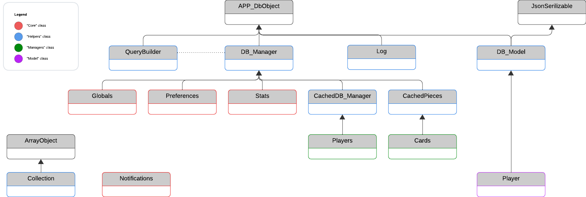

========
Overview
========

This page gives a general understanding of the boilerplate, its components, and how they are organized.
It will help you navigate the documentation and understand the structure of the boilerplate.

`JS module <jsmodules/main.html>`_
---------

The JS module is pure JavaScript, no typescript is used in this boilerplate.
You can add any other extra file that will make use of the boilerplate functions for better organization.
However, the boilerplate is not specifically designed for a specific organisationnal pattern (unlike the PHP part).
You will find below a brief overview of the modules included:

`Core module <jsmodules/core.html>`_
~~~~~~~~~~~

The ``Core`` module contains essential functions for the frontend, including basic animations, helper functions, and more.

`Modal Module <jsmodules/modal.html>`_
~~~~~~~~~~~~~

The ``Modal`` module provides a modal window that can be used to display messages, confirmation dialogs, configuration panel, etc.

`Player module <jsmodules/player.html>`_
~~~~~~~~~~~~~

The ``Player`` module offers functions to interact with player data, such as retrieving the player's color, name, and managing player-specific templates.

`PHP module <phpmodules/main.html>`_
------------------------------------

The PHP module is organized in several class, splitted in 4 main directories : `Core`, `Helpers`, `Managers` and  `Models`.
A fourth directory is also present, `States`, which contains traits for the game states.

The different classes are organized following this diagram:

As you can see, the `DB_Manager` and `CachedDB_Manager` modules are key in the boilerplate and relies on the `QueryBuilder`.

`CachedDB_Manager Module <phpmodules/cachedb_manager.html>`_
~~~~~~~~~~~~~~~~~~~~~~~~~~~~~~~~~~~~~~~~~~~~~~~~~~~~~~~~~~~~

This class is used to manage the database connection and cache the results of the queries.

`QueryBuilder Module <phpmodules/querybuilder.html>`_
~~~~~~~~~~~~~~~~~~~~~~~~~~~~~~~~~~~~~~~~~~~~~~~~~~~~~

This class is used to build SQL queries in a more readable and efficient way.

`CachedPiece Module <phpmodules/cachedpiece.html>`_
~~~~~~~~~~~

This class is used to manage the pieces of the game, manage storage and Casting

`Collection Module <phpmodules/collection.html>`_
~~~~~~~~~~

This class is used to manage collections of objects, with methods to filter, sort, and manipulate the collection.

`Log Module <phpmodules/log.html>`_
~~~~~~~~~~

This class is used to log the history of the game and handle a complete Undo system.
It includes a move by move and complete turn undo.
It also enables to log "checkpoints", which are undoable states of the game.

`utils Module <phpmodules/utils.html>`_
~~~~~

This class is used to store utility functions that are used in the game.