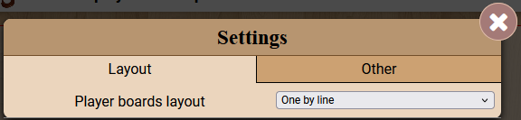

========
Overview
========

This page gives a general understanding of the boilerplate, its components, and how they are organized.
It will help you navigate the documentation and understand the structure of the boilerplate.

All listed modules are described in more detail in their dedicated pages (titles links to the corresponding page).

`JS module <jsmodules/main.html>`_
----------------------------------

The JS module is pure JavaScript, no typescript is used in this boilerplate.
You can add any other extra file that will make use of the boilerplate functions for better organization.
However, the boilerplate is not specifically designed for a specific organisationnal pattern (unlike the PHP part).
You will find below a brief overview of the modules included:

`Core module <jsmodules/core.html>`_
~~~~~~~~~~~~~~~~~~~~~~~~~~~~~~~~~~~~~~~

The ``Core`` module contains essential functions for the frontend, including basic animations, helper functions for managing action buttons, and more.

`Modal Module <jsmodules/modal.html>`_
~~~~~~~~~~~~~~~~~~~~~~~~~~~~~~~~~~~~~~~

The ``Modal`` module provides a modal window that can be used to display messages, confirmation dialogs, configuration panel, etc.
By default, the boilerplate includes a "setting" modal that can be used to configure the preferences of the player.

    
    Modal Settings

`Player module <jsmodules/player.html>`_
~~~~~~~~~~~~~~~~~~~~~~~~~~~~~~~~~~~~~~~~~

The ``Player`` module offers functions to interact with player data, such as retrieving the player's color, name, and managing player-specific templates.

`PHP module <phpmodules/main.html>`_
------------------------------------

The PHP module is organized in several class, splitted in 4 main directories : `Core`, `Helpers`, `Managers` and  `Models`.
A fourth directory is also present, `States`, which contains traits for the game states.

The different classes are organized following this diagram:

.. figure:: img/ReldiagramtisaacsBoilerplateBGA-PHP.png
    :alt: PHP Module Diagram
    :align: center
    :width: 600px

    PHP Modules and their relationships

As you can see, the `DB_Manager` and `CachedDB_Manager` modules are key in the boilerplate and relies on the `QueryBuilder`.

`QueryBuilder Module <phpmodules/querybuilder.html>`_
~~~~~~~~~~~~~~~~~~~~~~~~~~~~~~~~~~~~~~~~~~~~~~~~~~~~~

This class is used to build SQL queries in a more readable and efficient way, providing a fluent interface for building queries
It abstract SQL query construction, reducing the need for raw SQL writing to almost zero. Common database operations are implemented (SELECT, INSERT, UPDATE, DELETE) and data sanitization is handled to prevent SQL injection.
Thanks to readable syntax, simplify complex it query constructions like WHERE clauses and JOINs. It also offer convenience methods for common operations (e.g., count, min, max).
Finally, the QueryBuilder is connected with the Log module to log database changes and enable the Undo system.

**Key Features:**

    - Table-centric: Each QueryBuilder instance is associated with a specific table
    - Chainable methods: Allows for intuitive query construction
    - Data type handling: Can cast results to specific object types
    - Flexible WHERE clauses: Supports various formats and combinations
    - Automatic ID handling: Often uses a primary key (default 'id') for operations
    - Batch operations: Supports multiple inserts in one query
    - Query modifiers: Includes ORDER BY, LIMIT, and OFFSET functionality
    - Aggregation functions: Provides methods for COUNT, MIN, and MAX operations

**Examples:**

.. code-block:: php

    # SELECT query
    $attackedShips = (new QueryBuilder('ships'))
    ->select(['id', 'health', 'position'])
    ->where('status', 'attacked')
    ->orderBy('id', 'ASC')
    ->get();

    # INSERT query
    $newShip = (new QueryBuilder('ships'))
        ->insert(['name' => 'Destroyer', 'health' => 100, 'position' => 'A1']);

    # multiple INSERT query
    $values = [
        ['name' => 'Destroyer', 'health' => 100, 'position' => 'A1'],
        ['name' => 'Cruiser', 'health' => 150, 'position' => 'B2'],
        ['name' => 'Submarine', 'health' => 200, 'position' => 'C3']
    ];
    $newShips = (new QueryBuilder('ships'))
        ->multipleInsert(['name', 'health', 'position'])
        ->values($values);

Note that the QueryBuilder is used by the `(Cached)DB_Manager` modules, itself connected to the QueryBuilder module.
You will rarely need to directly use the QueryBuilder module in your game, but you can take this module in another implementation if you want to use it in another context.

`CachedDB_Manager Module <phpmodules/cachedb_manager.html>`_
~~~~~~~~~~~~~~~~~~~~~~~~~~~~~~~~~~~~~~~~~~~~~~~~~~~~~~~~~~~~

This class is used to manage the database connection and cache the results of the queries.

`CachedPiece Module <phpmodules/cachedpiece.html>`_
~~~~~~~~~~~~~~~~~~~~~~~~~~~~~~~~~~~~~~~~~~~~~~~~~~~~

This class is used to manage the pieces of the game, manage storage and Casting

`Collection Module <phpmodules/collection.html>`_
~~~~~~~~~~~~~~~~~~~~~~~~~~~~~~~~~~~~~~~~~~~~~~~~~

This class is used to manage collections of objects, with methods to filter, sort, and manipulate the collection.

`Log Module <phpmodules/log.html>`_
~~~~~~~~~~~~~~~~~~~~~~~~~~~~~~~~~~~~

This class is used to log the history of the game and handle a complete Undo system.
It includes a move by move and complete turn undo.
It also enables to log "checkpoints", which are undoable states of the game.

`Utils Module <phpmodules/utils.html>`_
~~~~~~~~~~~~~~~~~~~~~~~~~~~~~~~~~~~~~~~~

This class is used to store utility functions that are used in the game.